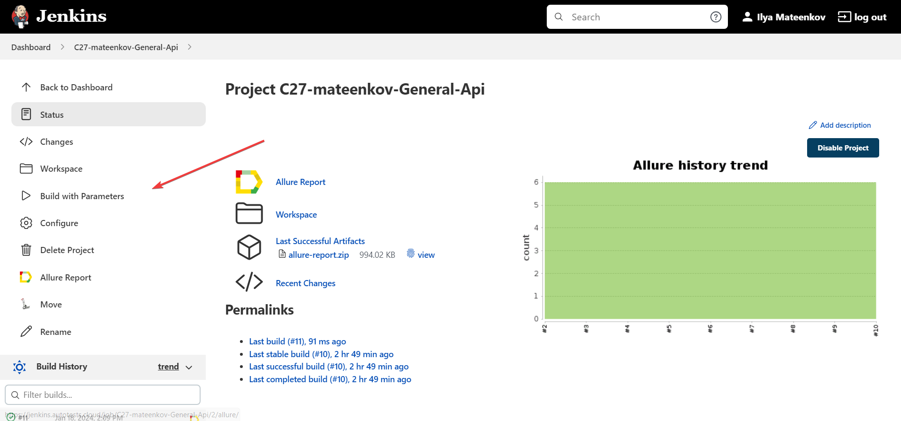
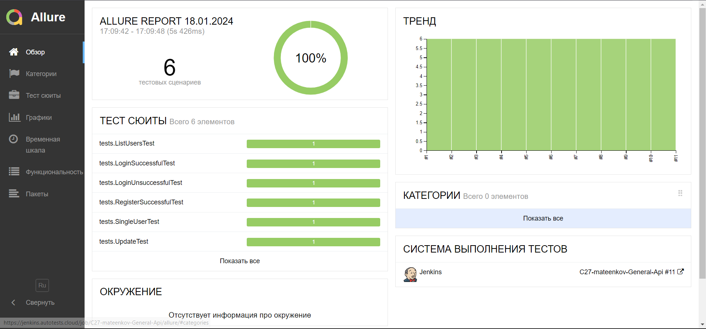
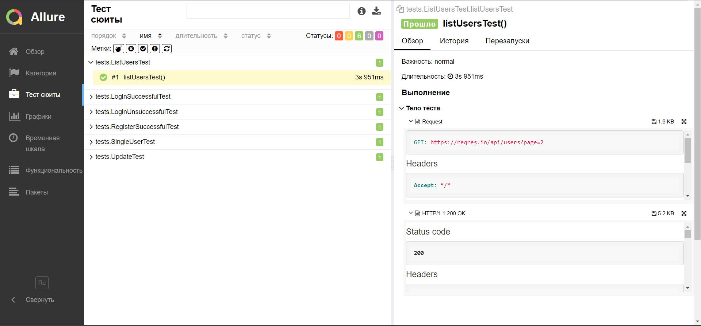
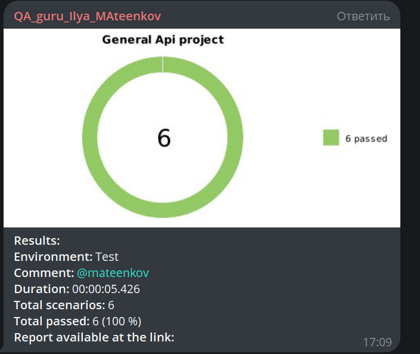

# Дипломный проект по автоматизации тестирования API на [reqres.in](https://reqres.in/)


---

### ✏️ Описание проекта 
Проект по автоматизации тестирования Api с использованием платформы открытого доступа [reqres.in](https://reqres.in/)
Проект разработан для локального и удаленного  развертывания и запуска api авто-тестов. 

Проект находится в открытом доступе, поэтому вы можете его скачать, доработать, кастомизировать или использовать как шаблон для ваших целей.

---

### 🧰 Используемые технологии и инструменты:

| Java                                                                                                      | IntelliJ Idea                                                                                                                 | GitHub                                                                                                     | JUnit 5                                                                                                           | Gradle                                                                                                     | Jenkins                                                                                                           |
|:----------------------------------------------------------------------------------------------------------|-------------------------------------------------------------------------------------------------------------------------------|------------------------------------------------------------------------------------------------------------|-------------------------------------------------------------------------------------------------------------------|------------------------------------------------------------------------------------------------------------|-------------------------------------------------------------------------------------------------------------------:|
| <a href="https://www.java.com/"></a>  | <a id ="tech" href="https://www.jetbrains.com/idea/"></a> | <a href="https://github.com/"></a> | <a href="https://junit.org/junit5/"></a> | <a href="https://gradle.org/"></a>  |   <a href="https://www.jenkins.io/"></a> |


| Allure                                                                                                                     |
|----------------------------------------------------------------------------------------------------------------------------|
| <a href="https://github.com/allure-framework"></a> |


### 💻 Запуск тестов из терминала :

`gradle clean test`

---

### Удаленный запуск тестов через [Jenkins:](https://jenkins.autotests.cloud/job/C27-mateenkov-General-Api/)

Запустить авто-тесты можно по кнопке ```Build with parameters```



### Allure-отчетность:

По кнопке со значком  Allure можно увидеть всю отчетность:




### Отчетность в Telegram:

После прохождения всех тестов приходит уведомление в Telegram с небольшим отчетом


