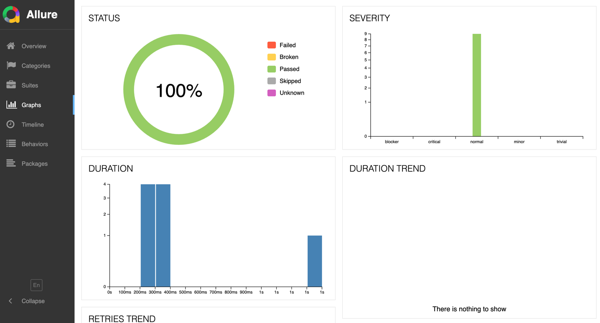
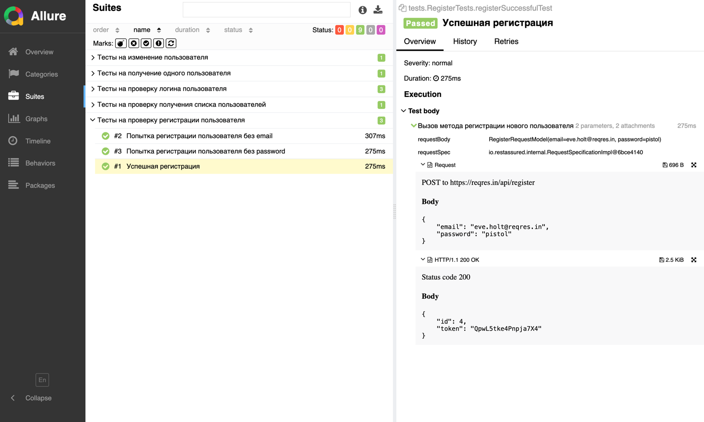

# ☕️ Java REST API Tests

## 📘 О проекте

Этот репозиторий содержит **автоматизированные API-тесты** на **Java**, построенные с использованием фреймворков  
**RestAssured**, **JUnit 5**, **Allure**, **Maven/Gradle** и **Lombok**.


Проект создан для тестирования публичного API [reqres.in](https://reqres.in), а также для демонстрации лучших практик
автоматизации API-тестирования.

🔗 Репозиторий: [imateenkovv/java-rest-tests](https://github.com/imateenkovv/java-rest-tests)

---

## 🚀 Технологии и стек

- ☕ **Java 17+**
- 🧪 **JUnit 5** — тестовый фреймворк
- 🌐 **RestAssured** — взаимодействие с API
- 🧱 **Lombok** — сокращение шаблонного кода (модели)
- 📊 **Allure Report** — визуальные отчёты
- ⚙️ **Maven / Gradle** — управление зависимостями

---

## 📂 Структура проекта

```
java-rest-tests/
├─── gradle 
├─── img                     # Скриншоты 
├─── src 
├─── test
│   ├── java
│       ├── checkers        # Классы для проверок
│       ├── common          # Логика обработки запросов/ответов и ошибок
│       ├── helpers         # Allure listeners
│       ├── testData        # Тестовые данные 
│       ├── tests           # Тестсьюты
│   ├── resources
└── README.md
```

---

## ⚙️ Установка и запуск

### 1️⃣ Клонируйте репозиторий:

```bash
    git clone https://github.com/imateenkovv/java-rest-tests.git
    cd java-rest-tests
```

### 2️⃣ Установите зависимости и соберите проект:

```bash
   gradle clean test
```

### 3️⃣ Сгенерируйте Allure-отчёт:

```bash
    allure serve build/allure-results
```

---

## 📈 Пример отчёта Allure

<p align="center">
  
  
</p>

---

## 👨‍💻 Автор

- Илья Матеенков
- QA Automation Engineer (Java/Python)
- 📎 GitHub: imateenkovv
- [Мое резюме](https://hh.ru/resume/4a1f3e52ff09c71d1e0039ed1f6f4b506b5837?hhtmFrom=resume_list)


